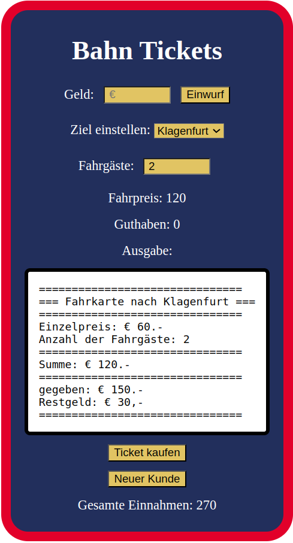

# 2AHWII SWP, 11. März 2025

## Ticketautomat

Hier wurde Einiges an Javascript-Logik entfernt ... in `app.js` findest Du
allerdings einige brauchbare Sachen - nimm es als Ausgangspunkt!

### Aufgabe 1: Einwurf (7p)

Beim Drücken des "Einwurf" Buttons soll:

- Das Guthaben des Kunden entsprechen erhöht werden
- Das input-Feld neben "Geld" wieder zurückgesetzt werden

### Aufgabe 2: Fahrpreis (7p)

Der Fahrpreis wird berechnet aus der Anzahl der Fahrgäste mal dem eingestellten
Ziel. Die Preise sind im Objekt `zieleUndPreise` definiert. Das Element "Fahrpreis"
soll sich neu berechnen, wenn eine der beiden Variablen sich ändert.

### Aufgabe 3: Ausgabe des Tickets bei "Ticket kaufen" (12p)

```text
===============================
=== Fahrkarte nach Salzburg ===
===============================
Einzelpreis: € 30.-
Anzahl der Fahrgäste: 3
===============================
Summe: € 90.-
===============================
gegeben: € 100.-
Restgeld: € 10,-
===============================
```

- Das Ticket soll gemäß der Vorlage in das Feld "Ausgabe"
gelegt werden
- Fahrgäste soll auf 1 gesetzt werden
- Guthaben auf 0 (mit dem Ticket gab es ja das Restgeld)
- Die Summe des Tickets soll zu den Gesamt-Einnahmen dazu addiert werden.

### Aufgabe 4: neuer Kunde (6p)

- Alle Felder sollen zurückgesetzt werden
- in die Ausgabe soll "bitte wählen Sie ein Ziel"

## Erklärungen

Es gibt 2 Geldfächer:

1. Guthaben .. dies ist der "credit" des aktuellen Kunden
2. Gesamt-Einnahmen .. Dies ist der Speicher für alles eingenommene Geld.

## Punkteschlüssel

Es sind insgesamt 32 Punkte möglich: `0-16 / 17-20 / 21-24 / 25-28 / 29-32`


